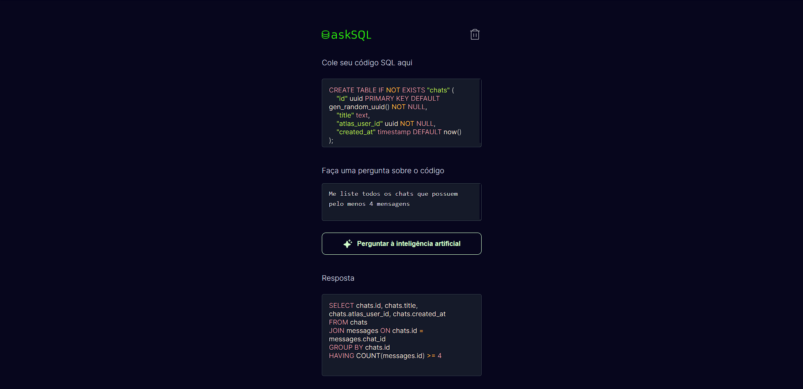

This is a [Next.js](https://nextjs.org/) project made following the metrics established by Rocketseat in the bora-codar challenge #32

## Getting Started

- npm install (to install all necessary dependencies)
- Create a open ai api key in https://platform.openai.com/account/api-keys
- Create a file .env.local and add (OPENAI_API_KEY="Add the key created here")

so run the development server:

```bash
npm run dev
# or
yarn dev
# or
pnpm dev
```

Open [http://localhost:3000](http://localhost:3000) with your browser to see the result.

